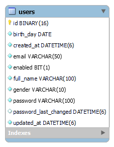
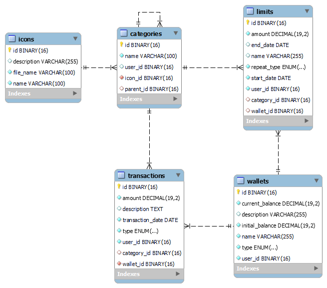

# Expense Management System - Moneta (Money Target)

<p align="justify">
Moneta is a personal expense management backend built with <strong>Spring Boot</strong> and a <strong>microservices architecture</strong>. The system provides authentication, wallet management, category management, transaction tracking, spending limits, and expense reporting. 
</p>

## Technology Stack

* **Backend Framework**: Spring Boot
* **Architecture**: Microservices
* **Database**: MySQL
* **Caching**: Redis
* **API Gateway**: Spring Cloud Gateway
* **Authentication**: Spring Security, JWT (JSON Web Tokens)
* **ORM**: Spring Data JPA/Hibernate
* **Containerization**: Docker & Docker Compose
## Architecture 

<p align="center">
  
</p>

### 1. API Gateway
* **Request Routing**: Routes incoming client requests to the appropriate microservice.
* **Authentication**: Validates JWT tokens and protects secured API endpoints.
* **Centralized Entry Point**: Provides a single entry point for clients to access backend services.
* **Service Isolation**: Hides internal microservices from direct external access.

### 2. Authentication Service (`/auth/**`, `/users/**`)
* **User Registration**: Allows users to create a new account with their personal information and credentials.
* **User Authentication**: Authenticates users using their email and password.
* **JWT Access/Refresh Token**: Generates and manages access and refresh tokens for secure user authentication.
* **User Information**: Provides APIs for authenticated users to view and manage their account information.
* **Logout & Token Revocation**: Supports logout by adding revoked tokens to a Redis-based blacklist.
  
### 3. Expense Service (`/expense/**`)

* **Authentication & User Identification**: Validates JWT tokens and extracts the authenticated user's ID to ensure users can only access their own resources.
* **Icon Management**: Provides a predefined set of icons that can be assigned to categories for visual identification.
* **Category Management**: Provides default and user-specific categories for organizing transactions.
* **Wallet Management**: Allows users to create and manage wallets, including cash, bank accounts, credit cards, and e-wallets.
* **Transaction Management**: Allows users to create, update, delete, and track income and expense transactions.
* **Spending Limits**: Allows users to set spending limits based on time periods, categories, or wallets.
* **Expense Reports**: Provides spending and income reports over different time periods.

### 4. Database (MySQL)

* **Database per Service**: Each microservice has its own dedicated database to ensure data isolation and service independence.
* **Auth Database**: Stores user accounts and authentication-related data for the Auth Service.
* **Expense Database**: Stores wallets, categories, icons, transactions, and spending limits for the Expense Service.

### 5. Cache (Redis)

* **Token Blacklist & TTL**: Stores revoked JWT tokens with a TTL to automatically expire them and prevent them from being reused after logout.
* **Caching**: Caches frequently accessed data to reduce database queries and improve API response performance.

## EER Diagram

### 1. Auth Database

Stores user accounts and authentication-related data used by the Auth Service.

<p align="center">  </p>

### 2. Expense Database

Stores expense-related data, including wallets, categories, icons, transactions, and spending limits used by the Expense Service.

<p align="center">  </p>

## Getting Stared

### 1. Clone Repository
Clone the repository and navigate to the project directory: 

```
git clone https://github.com/neyudmi/moneta-api.git
```

### 2. Install Docker

Make sure Docker and Docker Compose are installed on your machine.

### 3. Start Service

You can manually pull all required Docker images defined in the Docker Compose configuration:

```
docker compose pull
```

Or simply start the application directly. Docker Compose will automatically pull the required images if they are not available:

```
docker compose up -d
```

### 4. Access Service 

Once all containers are running, the API Gateway will be available at: http://localhost:8000

Alternatively, access Swagger UI to explore and test the available APIs: http://3.25.236.100/swagger-ui/index.html


